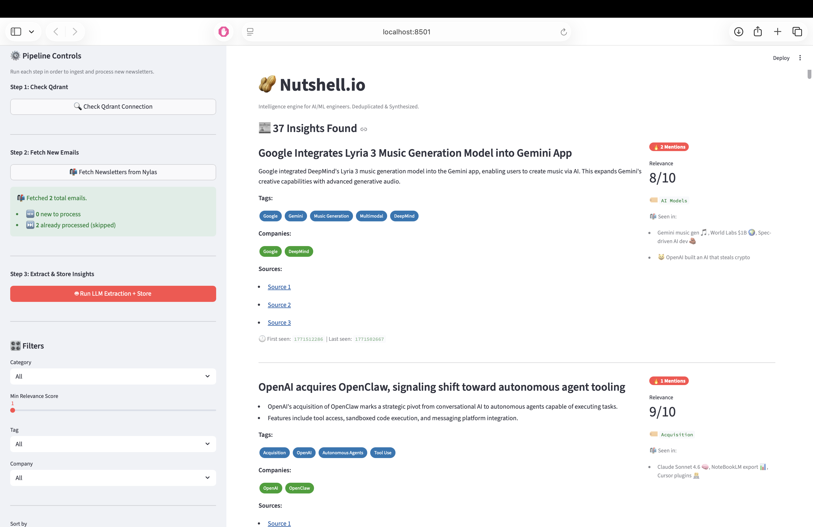

# Nutshell.io 🥜

_Automated intelligence extraction and semantic deduplication engine for the AI news ecosystem._



---

## Problem & Solution

> **The Fragmentation Problem:** High-signal technical updates are buried in 15+ daily newsletters (TLDR, The Neuron, etc.), leading to "Tab Fatigue," duplicate consumption, and lost context.

> **The Architectural Solution:** A unified "Command Center" that transforms raw unstructured text into structured **Intelligence Nodes**. It uses semantic similarity to detect that various newsletters are talking about the same _model release_, merging them into a single, comprehensive insight.

## Architecture


**System Flow:**

1. **Ingestion:** Fetches emails via Nylas, cleaning HTML/CSS noise.
2. **Extraction:** An LLM Agent parses text into structured `IntelligenceNode` objects (Headline, Summary, Links, Tags).
3. **Deduplication:** Embeddings are generated for headlines. If a new item is semantically similar to an existing vector (Threshold > 0.85), payload fields are merged rather than duplicated.

## Key Features

- **🧠 Semantic Deduplication Engine**
  Uses vector embeddings to identify that "OpenAI releases GPT-5" and "OpenAI's latest model is here" are the same event, merging sources into a single `IntelligenceNode`.

- **🔍 Structured Entity Extraction**
  Transforms unstructured prose into strongly typed Pydantic models, extracting metadata like `Relevance Score` (1-10), `Companies Mentioned`, and `Key People`.

- **📊 Signal-to-Noise Filtering**
  Post-processing logic filters out advertisements, "In Case You Missed It" recaps, and non-technical fluff based on semantic density and keyword heuristics.

## Tech Stack

| Component      | Technology    | Reasoning                                                               |
| :------------- | :------------ | :---------------------------------------------------------------------- |
| **Language**   | Python 3.10+  | Native support for vector libraries and Pydantic.                       |
| **Vector DB**  | Qdrant        | Efficient vector search with payload filtering; run locally via Docker. |
| **Embeddings** | FastEmbed     | Low-latency local embedding generation (avoiding API latency).          |
| **LLM**        | OpenAI GPT-4o | High-fidelity structured output via JSON mode for extraction.           |
| **Ingestion**  | Nylas API     | Unified API for handling email protocols (IMAP/Exchange).               |
| **Frontend**   | Streamlit     | Rapid prototyping for data-intensive dashboards.                        |

## Quick Start

### Prerequisites

- Python 3.10+
- Docker (for Qdrant)
- OpenAI API Key
- Nylas API Credentials

### Installation

1.  **Clone the repository**

    ```bash
    git clone https://github.com/jiten0709/Nutshell.io.git
    cd Nutshell.io
    ```

2.  **Set up environment**

    ```bash
    uv venv
    source .venv/bin/activate
    uv pip install -r requirements.txt
    ```

3.  **Configure `.env`**

    ```bash
    cp .env.example .env
    # Add your NYLAS_*, OPENAI_*, and QDRANT_* keys
    ```

4.  **Run the Stack**

    ```bash
    # 1. Start Vector DB
    docker run -p 6333:6333 qdrant/qdrant

    # 2. Run Dashboard (Use sidebar to ingest & process)
    streamlit run src/app.py
    ```

## Contributing

Contributions are welcome. Please open an issue to discuss proposed architectural changes before submitting a PR.

---

<p align="center"><em>Made with ❤️ by Jiten</em></p>
